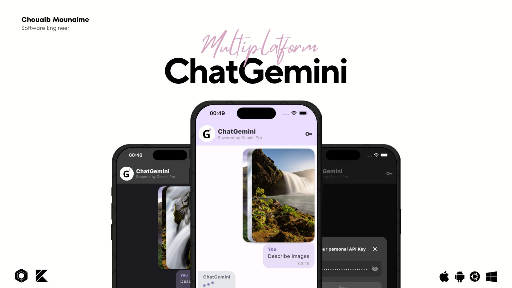

<p> 
  
</p>

<a href="https://github.com/chouaibMo/ChatGemini">

</a>

# 🤖 ChatApp - 多平台智能聊天应用

## 💡 项目简介

一个基于 Compose Multiplatform 构建的跨平台智能聊天应用，支持多种 AI 模型，包括 Gemini Pro、Kimi、豆包和自定义模型。提供强大的多模态对话能力和丰富的自定义选项。

## 📱 支持平台

本项目支持以下平台：
* **Android** - 完整功能支持
* **iOS** - 完整功能支持  
* **Desktop** - Linux、macOS、Windows 桌面版

> 注：浏览器支持正在开发中，将在未来版本中添加。

## ✨ 核心功能

### 🧠 多模型支持
* **Gemini Pro** - Google 最新的生成式 AI 模型
* **Kimi** - 月之暗面的长文本处理模型
* **豆包** - 字节跳动的智能对话模型
* **自定义模型** - 支持 OpenAI 兼容的 API 接口

### 💬 智能对话
* 纯文本对话生成
* 多模态输入支持（文本 + 图片）
* Markdown 格式渲染
* 对话历史管理
* 实时流式响应

### 🎨 用户体验
* 深色/浅色主题切换
* 多语言界面支持
* 响应式设计适配
* 直观的设置界面

### ⚙️ 高级配置
* **API 管理** - 统一管理所有模型的 API 密钥
* **自定义模型配置** - 支持添加任意 OpenAI 兼容的 API
* **模型参数调节** - 温度、最大 token 数等参数自定义
* **请求格式支持** - OpenAI、Anthropic 等多种 API 格式

## 🚀 快速开始

### 前置要求

1. **获取 API 密钥**：
   - Gemini Pro: https://ai.google.dev
   - Kimi: https://platform.moonshot.cn
   - 豆包: https://www.volcengine.com/product/doubao
   - 自定义模型: 根据具体服务商获取

2. **开发环境**：
   - Android Studio 或 IntelliJ IDEA
   - JDK 17+
   - Kotlin 1.9.21+

### 配置步骤

1. **克隆项目**：
```bash
git clone https://github.com/yjzhang2003/ChatApp.git
cd ChatApp
```

2. **配置 API 密钥**：
   - 启动应用后，进入设置页面
   - 在"API 管理"中配置各模型的密钥
   - 或在代码中直接设置（不推荐用于生产环境）

3. **运行项目**：
```bash
# Android
./gradlew :androidApp:installDebug

# Desktop
./gradlew :desktopApp:run

# iOS (需要 Xcode)
open iosApp/iosApp.xcodeproj
```

## 🔧 自定义模型配置

应用支持添加任何 OpenAI 兼容的 API 服务：

1. 进入"设置" → "自定义模型配置"
2. 点击"添加新模型"
3. 填写以下信息：
   - 模型名称和描述
   - API 端点 URL
   - 模型标识符
   - 请求格式（OpenAI/Anthropic/自定义）
   - 自定义请求头（可选）
   - 模型参数（温度、最大 token 等）

### 支持的 API 格式

- **OpenAI 格式**: 兼容 OpenAI ChatGPT API
- **Anthropic 格式**: 兼容 Claude API  
- **自定义格式**: 支持其他厂商的 API 格式

## 📋 版本历史

### v1.4.0 (即将发布)
- ✅ 新增多模型支持架构
- ✅ 添加自定义模型配置功能
- ✅ 实现 API 管理界面
- ✅ 优化 JSON 解析和错误处理
- ✅ 改进用户界面和交互体验

### v1.3.0 (当前版本)
- 基础 Gemini Pro 集成
- 多模态对话支持
- 主题切换功能
- 基本设置界面

## 🛠 技术栈

- **框架**: Compose Multiplatform
- **语言**: Kotlin
- **网络**: Ktor Client
- **序列化**: Kotlinx Serialization
- **状态管理**: MVVM + Compose State
- **图片处理**: Kamel Image Loading
- **Markdown**: Multiplatform Markdown Renderer

## 🤝 贡献指南

我们欢迎任何形式的贡献！

1. Fork 本项目
2. 创建功能分支 (`git checkout -b feature/AmazingFeature`)
3. 提交更改 (`git commit -m 'Add some AmazingFeature'`)
4. 推送到分支 (`git push origin feature/AmazingFeature`)
5. 创建 Pull Request

### 开发规范

- 遵循 Kotlin 编码规范
- 添加适当的注释和文档
- 确保跨平台兼容性
- 编写单元测试（推荐）

## 📄 许可证

```
Licensed under the Apache License, Version 2.0 (the "License");
you may not use this file except in compliance with the License.
You may obtain a copy of the License at

   http://www.apache.org/licenses/LICENSE-2.0

Unless required by applicable law or agreed to in writing, software
distributed under the License is distributed on an "AS IS" BASIS,
WITHOUT WARRANTIES OR CONDITIONS OF ANY KIND, either express or implied.
See the License for the specific language governing permissions and
limitations under the License.
```

## 💙 支持项目

如果这个项目对你有帮助，请给我们一个 ⭐️ 

---

**联系方式**: 如有问题或建议，请通过 Issues 或 Discussions 与我们联系。

